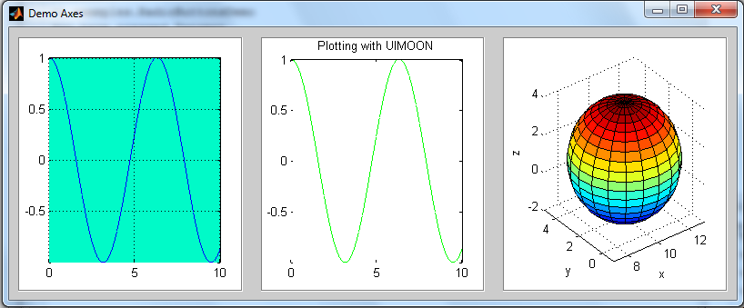

## uimoon

MATLAB Graphical User Interfaces with Object Oriented Design, inspired in Java and wxPython syntax.


### Project status

Non-usable version available, currently in development.


### Demos

**Creating a frame**

```matlab
function FrameDemo
% Demo for UIMOON 0.1.0
% Author: Pedro Jorge De Los Santos
% Project URL: https://github.com/JorgeDeLosSantos/uimoon
% License: MIT License
%
import uimoon.core.*

app = Frame('App');
app.Centre(true)
app.Resize(false);
app.SetColor(rand(1,3));
app.SetTitle('Example');
app.SetIcon('images/icono.png');
end
```


**Using Axes class**

```matlab
function AxesDemo
% Demo for UIMOON 0.1.0
% Author: Pedro Jorge De Los Santos
% Project URL: https://github.com/JorgeDeLosSantos/uimoon
% License: MIT License
%
import uimoon.core.*

app = Frame('Demo Axes',[800,300]);
app.Center(); % Center Frame
app.SetLayout('horizontal',10);

% Axes
ax1 = Axes();
ax2 = Axes();
ax3 = Axes();

app.AddMany(ax1,ax2,ax3);

x = linspace(0,10);
y = cos(x);

% Plot a sphere in ax1
ax1.Sphere(10,2,1,3);
ax1.SetLabels('x','y','z');

% Plot 2D-Lines in ax2
ax2.Plot2D(x,y,'g');
ax2.SetTitle('Plotting with UIMOON');

% Plot 2D-Lines in ax3
ax3.Plot2D(x,y,'b');
ax3.SetGrid(true);
ax3.SetColor([0,250,200]/255);
end
```



### How to install?

Downloads or clones this repository and add the folder project to the MATLAB path, or "installs" the 
toolbox running the `uimoon_install` script.

### Contributing

If you find a bug, a bad feature, or have a enhancement proposal, please open a issue and comment it.
